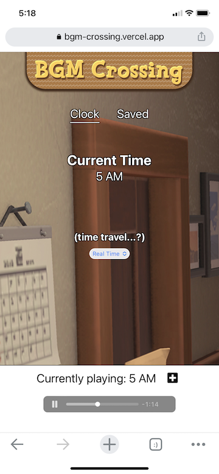

# BGM Crossing
Chill AC:NH hourly background music to relax and study to.

## Deployment
You can view the deployed app at [http://bgm-crossing.vercel.app](http://bgm-crossing.vercel.app)
- Consumes the [Animal Crossing: New Horizons API](http://acnhapi.com/) for music

## Local & Testing
To run this app locally and view its automated tests, do the following.

- Clone this repo to your local machine
- cd into the app directory
- run 'npm install' (installs dependencies)
- run 'npm start' (starts the server at localhost:3000)
- run 'npm run cypress' (opens the cypress testing interface)

## Learning Goals
  - React
    - Component architecture
    - Controlled forms
    - Stateful data management
  - React Router
  - 3rd-party API data usage
  - Asynchronous Javascript
  - Cypress E2E testing
## Features 
 - Show the current time
 - Play looping music according to the current time
 - Choose another time of day and play its music
 - Save tracks
 - Play or remove saved tracks

## Members
David Stavis - http://www.linkedin.com/in/dstavis

## Future Additions
- Change songs according to the weather (via geolocation weather API)
- Cause the song to change automatically without user interaction when the real-world hour changes
- Cause the background image to look dark at night time and bright during daytime
- CSS Animations of leaves rustling, balloon presents drifting
- Mr. Resetti cameo with cheeky comments when the user interacts with the Time Travel feature

## Links
- [Animal Crossing: New Horizons API](http://acnhapi.com/)
- [Trello Kanban Board](https://trello.com/b/5a3tYCvx/showcase)
- [Wireframes / Design inspo on Excalidraw](https://app.excalidraw.com/s/1Q1K6fNw53E/4H6CBsmRXs1)